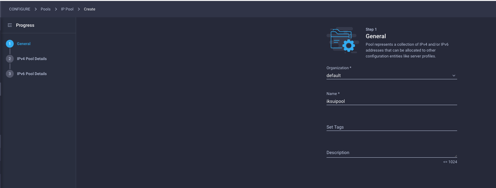
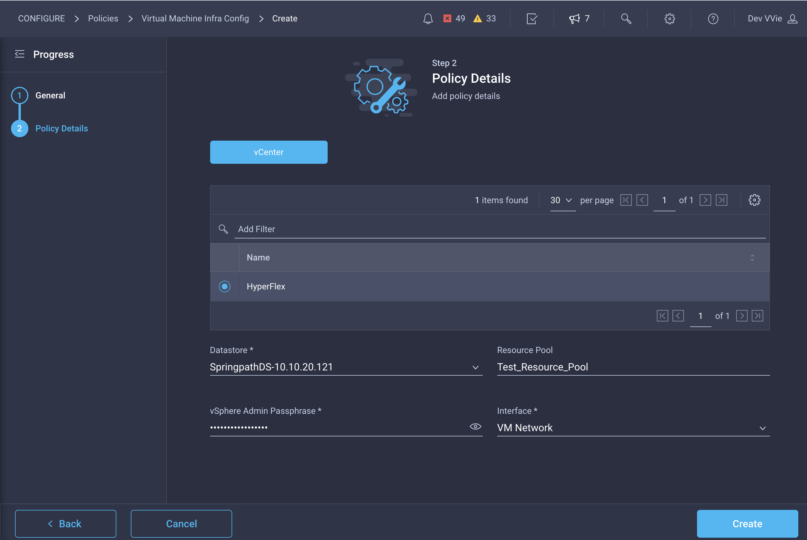
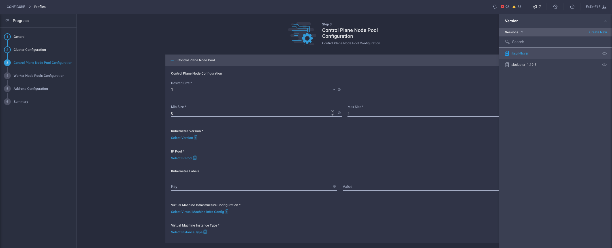
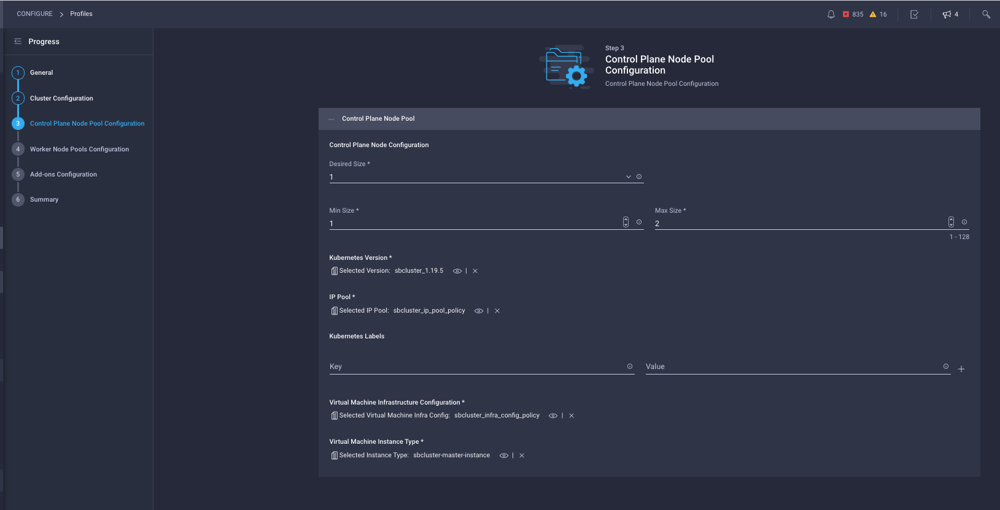
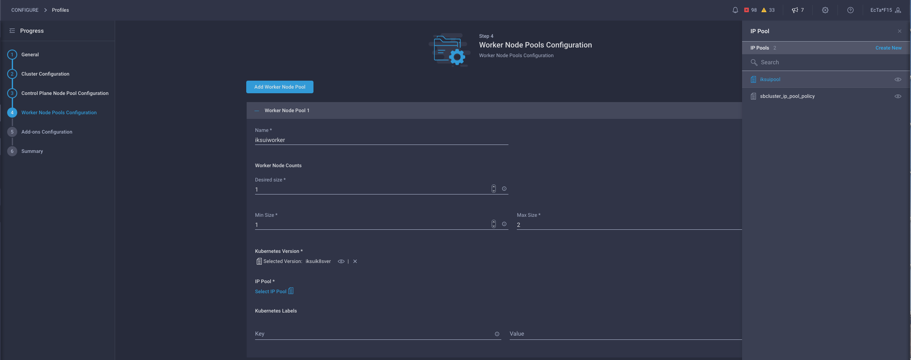
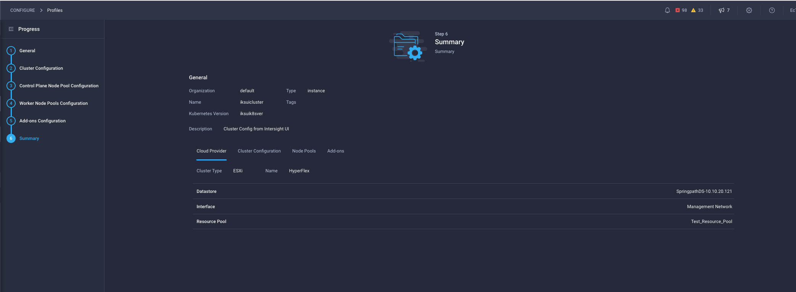

# Introduction

This lab walks you through the provisioning of an IKS cluster in Intersight using its UI and ClickOps. To automate the same with Intersight Service for Terraform, please refer to the following learning lab and sandbox:

https://devnetsandbox.cisco.com/RM/Diagram/Index/daad55dd-45f1-46c6-a1b4-7339b318c970?diagramType=Topology

## Objectives

When you complete this Learning Lab, you will be familiar with:
*	Use Intersight UI to provision IP Pool
*   Use Intersight UI to provision IKS policies
*   Use Intersight UI to provision IKS cluster profiles
*   Use Intersight UI to configure IKS add-ons
*   Use Intersight UI to scale up the cluster
*   Use Intersight UI to undeploy IKS cluster
*   Use Intersight UI to delete IKS cluster profile
*   Use Intersight UI to delete IKS policies

## Audience
*	Cloud Admins who would like to provide IT Container As A Service (CAAS) on vSphere Infrastructure  
*	DevOps who would like to deploy and manage k8s clusters

## Caveats

* For a successful tutorial, lab user will follow the instructions in this lab without modifying any other attributes or deleting any resources.

## Related Technologies

### Kubernetes as a Container Orchestration Platform

Kubernetes, also known as K8s, is an open-source system for automating deployment, scaling, and management of containerized applications.
One of the main tenets of Kubernetes is giving you the freedom to take advantage of on-premises, hybrid, or public cloud infrastructure, letting you effortlessly move workloads to where it matters to you.

While DevOps has successfully leveraged public clouds offerings of Kubernetes to host containerized workloads, IKS provides the platform to bring the same cloud experience on prem on your vSphere Infrastructure.

### Intersight Kubernetes Service - IKS

IKS is a SaaS-delivered, turn-key container management platform for multicloud, consistent production-grade Kubernetes. It:

*	runs on ANY infrastructure as a lightweight self-hosted software. Optimized for Cisco HX and UCS, deployed on top of VMware vSphere, with other Hypervisors and bare metal options coming soon
*	automates the deployment and lifecycle management (OS updates/Kubernetes updates) of 100% upstream self-service K8s clusters via an easy-to-use user interface
*	includes all the necessary networking (Calico CNI, Istio Service mesh), persistent storage (vSphere CSI), monitoring (Prometheus/Grafana), L4/L7 load balancing, registry tooling and RBAC configuration
*	integrates with AWS, Azure, and Google Cloud (coming soon)
*	is built for the enterprise with hardened security and enhanced availability features like multiple control nodes and self-healing features
*	optimized for AI/ML workloads with multi-GPU support


## Prerequisites

*   Please note the licensing requirement to use the Intersight Kubernetes Service in your own data center. You will need the Premier or Advantage license to be able to use IKS. The sandbox has these licenses pre-provisioned for lab users and so there is nothing you need to do to complete this learning lab.


*   Please make a reservation at the following IKS with UI & ClickOps Sandbox:

TBD - link to new SB?

*   Upon reservation, you will have received another email indicating access to VPN credentials.


*   Follow instructions in the invitaton email to connect to the sandbox VPN (this is necessary to access the vSphere, IKS cluster and App instance later.)

*   Generate SSH keys and make a note of the public and private keys and their locations. You will need this in the cluster provisioning and access steps below.

## Pre-configured elements (Sandbox Topology)

To make for a consistent experience, the following elements are pre-configured in the accompanying sandbox environment.


##### Lab user accounts in Intersight SAAS
Intersight is a SaaS-delivered, common platform for intelligent visualization, optimization, and orchestration for applications and infrastructure across hybrid cloud. Lab user will be provided with a temporary account for the duration of this sandbox. You will need this to execute some manual steps later in the lab.


##### UCS Emulator
Cisco UCS Platform Emulator is the Cisco UCS Manager application bundled into a virtual machine (VM). The VM includes software that emulates hardware communications for the Cisco Unified Computing System (Cisco UCS) hardware that is configured and managed by Cisco UCS Manager.

##### Intersight Assist
Cisco Intersight Assist helps you add endpoint devices to Cisco Intersight. A datacenter could have multiple devices that do not connect directly with Cisco Intersight. Any device that is supported by Cisco Intersight but does not connect directly with it, will need a connection mechanism. Cisco Intersight Assist provides that connection mechanism, and helps you add devices into Cisco Intersight.

##### VMWare vSphere
This is the hypervisor managing the IKS cluster VM’s being created for k8s control plane and worker nodes.


# Login to Intersight

1. Login to Intersight with the link provided in your invitation email. 

2. Examine pre-configured elements (Intersight Targets). The following targets are pre-configured in Intersight corresponding to the remote entities and agents that it integrates with. Please ignore the Terraform related Targets since we will not be using those in this learning lab.


The above targets are required to account for Intersight's integrations with the on prem entities. 

#### If the vSphere Target shows as "Not Connected", try editing the Target and changing an attribute like the Datastore Enabled setting and Save. If any of the Targets still shows as "Not Connected" please do not use the sandbox - you can terminate and start another reservation. 

# Use Intersight UI to provision IP Pool

As a Cloud Admin, you will allocate ip pools to the various application teams to provision their IKS clusters. You can either create a single pool that can be used for all of the IKS clusters or provision multiple IP Pools and assign each to individual application teams. 

#### PLEASE USE THE VALUES SPECIFIED IN THE SNAPSHOTS. THESE ARE THE VALUES THAT APPLY TO THE SANDBOX CONFIGURATION. 


Provision the following with the Sandbox infrastructure parameters and click Create. You can skip the IPv6 tab  for now since the support for this is currently not available.

```
Subnet Mask 255.255.255.0
Default Gateway 10.10.20.254
Primary DNS 10.10.20.100
Secondary DNS - NA
Start Address - 10.10.20.170
Number - 20
```




# Use Intersight UI to provision IKS policies

Next, you will provision IKS policies that will be leveraged by your DevOps teams to provision their IKS cluster. 

#### PLEASE USE THE VALUES SPECIFIED IN THE SNAPSHOTS. THESE ARE THE VALUES THAT APPLY TO THE SANDBOX CONFIGURATION. 

The following are the policies that you can configure:


__Step 1:__ Configure Kubernetes Version Policy:


__Step 2:__ Configure Network CIDR Policy:

```
POD Network CIDR - 100.65.0.0/16
Service CIDR - 100.64.0.0/24
```


__Step 3:__ Configure Node OS Policy

```
Timezone - America/New_York
DNS Suffix - demo.intra
DNS Server1 - 10.10.20.100
NTP Server1 - 10.10.20.100
```


__Step 4:__ Configure Virtual Machine Infra Config:

```
ESXi Cluster - HyperFlex
Datastore - SpringpathDS-10.10.20.121
Interface  - VM Network
Resource Pool - Test_Resource_Pool
vSphere Admin Passphrase - Enter the password that you got in your invitation email
```





__Step 5:__ Cofigure Virtual Machine Instance Type

```
CPU - 4
System Disk Size (GiB) - 40
Memory (MiB) - 16384
```


Your policy configuration listing should now looks as follows:


Your DevOps personel can now provision an IKS cluster based on the above policies.

# Use Intersight UI to provision IKS profile for you IKS cluster

Next, you will provision an IKS Profile. This defines the IKS cluster you want to create:


__Step 1__: Configure IKS General Info 
Intersight is Multi-Tenant and supports different organisations but for this sandbox please select the default organisation.


__Step 2__: Configure IKS Cluster - select IP Pool 
This IP Pool will be used for the Loadbalancer Services that we will create at a later stage. These are the IP's that will be assisgned to the application running on the IKS cluster.


__Step 3__: Configure IKS Cluster - select Node OS Policy 
This policy gets mapped under the DNS, NTP and Timezone section.


__Step 4__: Configure IKS Cluster - select Network CIDR Policy 


__Step 5__: Configure IKS Cluster - configure Load Balancer Count and SSH key. Enter the SSH public key that you generated before.


Click next, we won't configure any Trusted Registries or Container Runtime settings for now.

__Step 6__: Configure Control Plane Node Pool - select Kubernetes Version



__Step 7__: Configure Control Plane Node Pool - select ippool

These are the IP's which are getting assigned to the Control PLane VM's.


__Step 8__: Configure Control Plane Node Pool - select Virtual Machine Infra Config Policy


__Step 9__: Configure Control Plane Node Pool - select Virtual Machine Instance Policy


__Step 10__: Configure Control Plane Node Pool - select Desired Size for Control Plane
The Min and Max size are for upgrades, the desired size is the amount of control VM's that will be provisioned.



__Step 11__: Configure Worker Node Pools - select ippool, name and number of worker nodes



__Step 12__: Configure Add-ons


__Step 13__: Submit Cluster Provisioning Request



__Step 14__: Verify Cluster Provisioning Request is Configuring


__Step 15__: Examine Cluster Provisioning Request Workflow


__Step 16__: Verify that the cluster is configured:


Your App Developers can now deploy their containerized apps on the IKS cluster using kubectl or helm.


# Use Intersight UI to configure IKS add-ons

1. Connect to the sandbox VPN details of which will be in your invitation email. Also, save the ssh

2. Create a policy for the Dashboard add on:


3. Update the cluster profile and include the Add-on policy. Leave the other fields empty and hit Deploy:


4. Connect to the control plane node of the cluster that you just created

Get the Control plane node IP:


Download the kubeconfig for the cluster.


Connect to control plane node with ssh. Use the private key that you generated before.

ssh -i <your_private_ssh_key> iksadmin@<ctrlplanenode-ip>

5. Execute the following commands to get the data for the Dashboard access

Get the name of the default token:

    kubectl --kubeconfig <cluster-kubeconfig> get secrets -n kube-system | grep default-token

Get the password: 

    kubectl --kubeconfig <cluster-kubeconfig> get secret default-tokvv -n kube-system -o jsonpath='{.data.token}' | base64 -D

Navigate to Operate -> Kubernetes -> Select your cluster -> Operate -> Add-ons and click on your Add-on you should now see your Kubernetes Dashboard and you can login with the Token


Access the Dashboard at and enter the token acquired above:

    https://<ingress-controller-IP>/dashboard/


# Use Intersight UI to scale up the cluster

Update the cluster profile and increase the number of worker nodes, Deploy:


Refresh your Kubernetes Dashboard and see that the cluster has been scaled up:


# Use Intersight UI to Undeploy IKS cluster

Select cluster profile and Undeploy the IKS cluster before deleting it:


Check the workflow for the undeployment to terminate:


# Use Intersight UI to Delete IKS Profile

After cluster undeployment is done, please delete the cluster profile:


# Use Intersight UI to Delete IKS Policies

Select all the IKS policies and delete:


# Terminating you sandbox and cleanup

This concludes this learning lab. We hope you got an overview of provisioning and de-provisioning IKS clusters.

Help us terminate the sandbox and prepare it for the next labuser by terminating the sandbox that you just reserved:


