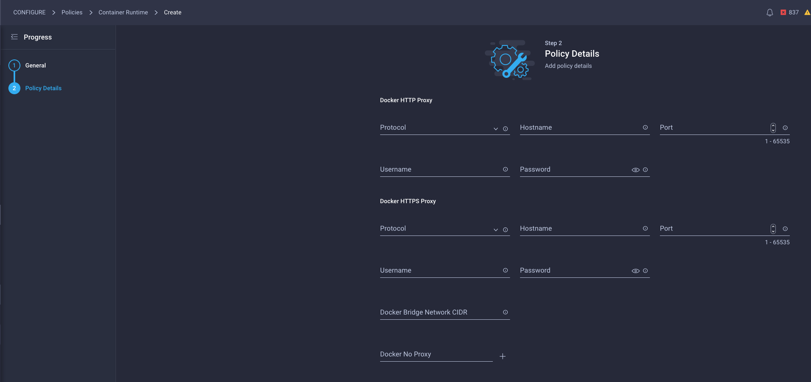
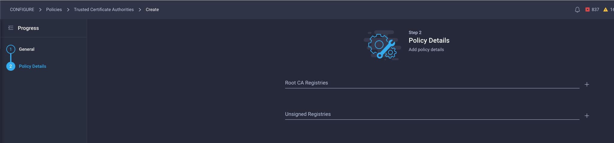

# Introduction

This lab walks you through the provisioning of an IKS cluster in Intersight using its UI and ClickOps. To automate the same with Intersight Service for Terraform, please refer to the following learning lab and sandbox:

TBD

## Objectives

When you complete this Learning Lab, you will be familiar with:
*	Use Intersight UI to provision IP Pool
*   Use Intersight UI to provision IKS policies
*   Use Intersight UI to provision IKS profiles
*   Use Intersight UI to provision IKS cluster
*   Use Intersight UI to configure IKS add-ons
*   Use Intersight UI to scale up and down the cluster
*   Use Intersight UI to change policies affecting several IKS clusters
*   Use Intersight UI to Undeploy IKS profiles
*   Use Intersight UI to Delete IKS Clusters

## Audience
*	Cloud Admins who would like to provide IT Container As A Service (CAAS) on vSphere Infrastructure  
*	DevOps who would like to deploy and manage k8s clusters

## Caveats

* For a successful tutorial, lab user will follow the instructions in this lab without modifying any other attributes or deleting any resources.

## Related Technologies

### Kubernetes as a Container Orchestration Platform

Kubernetes, also known as K8s, is an open-source system for automating deployment, scaling, and management of containerized applications.
On eof the main tenets of Kubernetes is giving you the freedom to take advantage of on-premises, hybrid, or public cloud infrastructure, letting you effortlessly move workloads to where it matters to you.
 
TBD - more explanation?

### Intersight Kubernetes Service - IKS

IKS is a SaaS-delivered, turn-key container management platform for multicloud, consistent production-grade Kubernetes. It:

*	runs on ANY infrastructure as a lightweight self-hosted software. Optimized for Cisco HX and UCS, deployed on top of VMware vSphere, with bare metal options coming soon
*	automates the installation, deployment and lifecycle management (OS updates/Kubernetes updates) of 100% upstream self-service K8s clusters via an easy-to-use simple ser interface
*	includes all the necessary networking (CNI, ACI CNI, Istio service mesh), persistent storage (CSI), logging (EKF), monitoring (Prometheus/Grafana), L4/L7 load balancing and registry tooling, RBAC configuration
*	integrates with AWS, Azure, and Google Cloud (coming soon)
*	is built for the enterprise with hardened security and enhanced availability features like multi-master nodes and self-healing
*	optimized for AI/ML workloads with multi-GPU support

## Prerequisites

*   Please verify licensing requirement to use the Intersight Kubernetes Service. You will need the Premier or Advantage license to be able to use IKS:

*   Please make a reservation at the following IKS with UI & ClickOps Sandbox:

TBD - link to SB?

*   Upon reservation, you will have received another email indicating access to VPN credentials.

*   Follow above instructions to connect to the necessary VPN connection (this is necessary to access the vSphere, IKS cluster and App instance later.)

## Pre-configured elements (Sandbox Topology)

To make for a consistent experience, the following elements are pre-configured in the accompanying sandbox environment.

##### Lab user accounts in Intersight SAAS
Intersight is a SaaS-delivered, common platform for intelligent visualization, optimization, and orchestration for applications and infrastructure across hybrid cloud. Lab user will be provided with a temporary account for the duration of this sandbox. You will need this to execute some manual steps later in the lab.

##### UCS Emulator
Cisco UCS Platform Emulator is the Cisco UCS Manager application bundled into a virtual machine (VM). The VM includes software that emulates hardware communications for the Cisco Unified Computing System (Cisco UCS) hardware that is configured and managed by Cisco UCS Manager.

##### Intersight Assist
Cisco Intersight Assist helps you add endpoint devices to Cisco Intersight. A datacenter could have multiple devices that do not connect directly with Cisco Intersight. Any device that is supported by Cisco Intersight but does not connect directly with it, will need a connection mechanism. Cisco Intersight Assist provides that connection mechanism, and helps you add devices into Cisco Intersight.

##### VMWare vSphere
This is the hypervisor managing the IKS cluster VM’s being created for k8s control plane and worker nodes.

# Login to Intersight

Next login to Intersight with the link provided in your invitation email. 

__Step 1:__: Examine pre-configured elements (Intersight Targets)

The following targets are pre-configured in Intersight corresponding to the remote entities and agents that it integrates with. Please ignore the Terraform related Targets since we will not be using those in this learning lab.

The above targets are required to account for Intersight's integrations with the on prem entities. If any of the above shows as "Not Connected" please do not use the sandbox - you can terminate and start another reservation.

# Use Intersight UI to provision IP Pool

As a Cloud Admin, you will allocate ip pools to the various application teams to provision their IKS clusters. You can either create a single pool that can be used for all of the IKS clusters or provision multiple IP Pools and assign each to individual applicatio teams.

Provision the following based on your specific vSphere installation and click Create. You can skip the IPv6 tab  for now since the support for this is currently not available.

# Use Intersight UI to provision IKS policies

Next, you will provision IKS policies that will be leveraged by your DevOps teams to provision their IKS cluster. 

The following are the policies tht you can configure:

__Step 1:__: Configure Kubernetes Version Policy:

__Step 2:__: Configure Container Runtime Policy:

__Step 3:__: Configure Network CIDR Policy:

__Step 4:__: Configure Node OS Policy

__Step 5:__: Configure Trusted Certificate Authorities Policy:

__Step 6:__: Configure Virtual Machine Infra Config:

__Step 7:__: Cofigure Virtual Machine Instance Type

Your DevOps personnel can now provision an IKS cluster based on the above policies.

# Use Intersight UI to provision IKS profile

# Use Intersight UI to provision IKS cluster

Next, you will now wear the hat of a DevOps persona and provision an IKS cluster. In real life, the IKS cluster profile will be driven by requirements from the App team. For the purposes of this lab, we will create a cluster with minimal resources considering that the sandbox is a resource constrained environment.

__Step 1__: 

__Step 2__: 

__Step 3__: 

__Step 4__: 

__Step 5__: 

__Step 6__: Login to Intersight and verify that the cluster is configured:

Your App Developers can now deploy their containerized apps on the IKS cluster.

# Use Intersight UI to configure IKS add-ons

# Terminating you sandbox and cleanup

This concludes this learning lab. We hope you got an overview of IST and TFCB and the value add of the integration of two flagship products - Cisco's Intersight and HashiCorp's Terraform Cloud for Business.

Help us terminate the sandbox and prepare it for the next labuser by terminating the sandbox that you just reserved:

